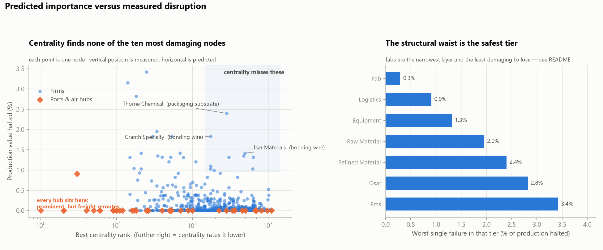
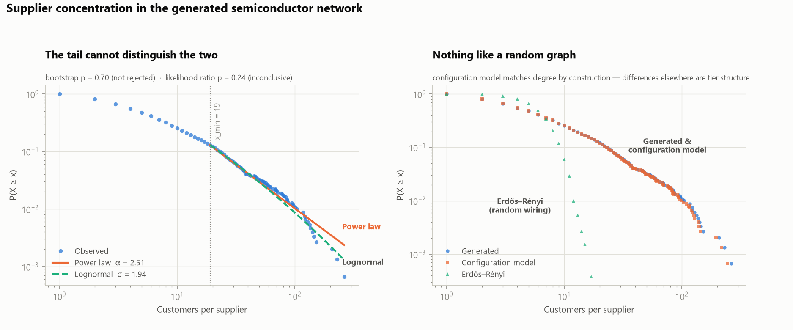

# Supply Chain Graph Engine

**Which single supplier, if it stopped shipping tomorrow, would halt the most production — and would you have found it by looking at your spend report?**

Usually not. Procurement analysis ranks suppliers by how much you buy from them, which finds the ones you depend on *directly*. It cannot see the small chemical firm three tiers upstream that eleven of your suppliers all quietly rely on. That firm never appears on a spend report, and it is the one that takes the line down.

This project models a semiconductor supply network as a directed graph and finds those nodes — the ones whose importance comes from **position**, not size.

> **Status: in progress.** Generator, statistical validation, criticality analysis, and the SQL warehouse are complete. The Power BI dashboard and executive brief are not yet built.

---

## Findings



Every non-OEM node was removed in turn and the resulting cascade measured. A firm fails when **any single required input** loses every qualified supplier; its customers are then re-checked, and failure propagates downstream.

**1. Centrality found none of the ten most damaging nodes.**

| | top 10 | top 25 | top 50 |
|---|---|---|---|
| betweenness | 0 | 5 | 13 |
| PageRank | 0 | 1 | 8 |
| customer count | 0 | 4 | 15 |

Rank correlation across all nodes looks respectable (ρ ≈ 0.39–0.47), but that number flatters the proxies — 70% of nodes break nothing at all and tie at the bottom of both rankings. At the top of the list, where someone would actually act, the proxies fail.

**2. The most central nodes in the graph are the least dangerous to lose.** Every port and air hub ranks in the top 10 by betweenness and causes *zero* production loss when closed, because freight reroutes through another gateway serving the same region. Centrality sees traffic; it cannot see substitutability.

**3. The real single points of failure are unglamorous materials suppliers.** Packaging substrate, bonding wire, and process gas — commodity inputs, mid-tier firms, ranked 175th to 640th by every centrality measure. They matter because they feed the assembly and test layer that everything passes through, and because they happen to be sole-qualified at enough buyers that losing one cascades.

**4. Fabs are the safest tier to lose, at 0.3%.** This is the counterintuitive one and it is a genuine limitation of the model, not a discovery — see below.

**5. Exposure is not the same as risk, and the gap is enormous.** Tracing forward from one packaging-substrate supplier, **811 of 820 finished-goods makers have a dependency path back to it** — 99% of the network's output is *potentially* exposed. The measured cascade halts **17**. That ratio, 811 potential to 17 actual, is precisely what dual-sourcing buys, and it is why "who is exposed to this vendor" and "who stops if this vendor fails" are different questions that get confused constantly.

**Scale:** worst single-node failure halts 3.4% of production ($43.6B). Deepest cascade runs 5 rounds. Under the blockade stress case — a gateway unavailable with *no* substitute, modelling closed airspace rather than a closed facility — one air hub reaches 64.6%. That figure is an upper bound and should never be quoted as "what happens if this hub closes."

### What this would have missed

The fab result exposes the model's main limitation honestly: **it models qualification redundancy, not capacity redundancy.** Having three qualified wafer suppliers counts as safe here. In reality it is only safe if those three have spare capacity to absorb the fourth's volume — and in semiconductors they almost never do. That is precisely why a real TSMC outage would be catastrophic while this model shows fabs as low-risk.

Two smaller gaps: rerouted freight is free here, capturing *whether* parts arrive but not *how late*; and only single-node failures are simulated, so correlated regional events are out of scope.

### Planted versus emergent

One expected result and one unexpected one, which is the test of whether the generator encodes mechanism rather than answers.

**Expected** — lithography came out the most single-sourced input at 66.7%, and gateway concentration dominates the blockade case. Both follow directly from configured rules, and finding them confirms the machinery works.

**Emergent** — nothing in the configuration says packaging substrate and bonding wire suppliers are critical, or that fabs are safe, or that ports are the most overrated nodes in the network. Those fall out of the interaction between BOM structure, per-input sourcing rules, and where the tiers happen to be concentrated.

---

---

## Why the data model is the whole project

The obvious criticism of any synthetic-data analysis is fatal if it lands: *you decided the answer, then wrote code that repeated it back to you.*

So the governing rule here is that the generator specifies **mechanisms, never outcomes**.

| Encoded (defensible) | Never encoded |
|---|---|
| 42% of wafer fabrication capacity sits in Taiwan | `FAB_0041.is_critical = True` |
| Lithography tools are single-sourced ~60% of the time, because requalifying a tool vendor takes years | "Port Alpha carries 45% of freight" |
| Firm sizes are lognormal; big firms attract more customers | Any hand-placed hub or bottleneck |
| Buyers prefer suppliers in their own region and trade bloc | Any node named in advance |

Search this repository for a `criticality` field or a hardcoded hub and you will not find one. Every concentration in the output is a **consequence** of those rules interacting with a random seed, which means it can be traced back to a mechanism — and re-derived from a different seed.

That is the difference between a demo with the punchline pre-loaded and a model.

## What gets generated

A ~2,700-node network across seven tiers, wired by bill of materials:

```
RAW MATERIAL ─┬─→ REFINED MATERIAL ─┬─→ FAB ─→ OSAT ─→ EMS ─→ OEM
              │                     │      ↗       ↗
              └─→ EQUIPMENT ────────┴─────┘───────┘
```

The shape matters. Real semiconductor supply chains are a **bowtie**: thousands of raw material sources, thousands of finished products, and a brutally narrow waist at wafer fabrication and lithography equipment. Tier populations reproduce that waist, because it is the structural reason the industry is fragile.

Some load-bearing details:

- **Edges are typed by product.** A buyer having eight suppliers is meaningless if all eight sell different inputs and the photoresist has exactly one qualified source. Redundancy is a per-input property, so the generator wires from a bill of materials rather than tier-to-tier.
- **Attachment is sublinear.** Plain Barabási–Albert (linear attachment) let one contract manufacturer capture 77% of all OEM relationships in an early run — a monopoly, not a supply chain. Raising the degree term to an exponent below 1 stands in for finite plant capacity and produces power-law-with-cutoff, which is what empirical studies of production networks actually find.
- **Equipment is a side branch, not a link.** No atom of a lithography vendor's output ends up inside a phone, yet no fab runs without one. Whether that branch surfaces as critical is a genuinely open question the analysis has to settle.

## Two graph projections

The same relationships are projected two ways, because "what is critical" depends on which question you asked.

**`commercial`** — firms only, direct supplier → buyer. *Who depends on whom to do business.*

**`physical`** — freight routed through seaports and air hubs. *What has to keep working for goods to physically arrive.*

They disagree, and the disagreement is the interesting part: a port can dominate the physical graph while being commercially replaceable — you reroute through another port at a cost in weeks, but you cannot reroute a sole-source photoresist supplier at all without 12–24 months of requalification.

Hubs are split into one **gate per tier transition** (`HUB_004::FAB>OSAT`), all sharing a `parent_hub`. Without that split, a port receiving from a board assembler and shipping to a materials firm creates edges running *backwards* up the chain — the first version of the physical graph was not acyclic at all, and every path-based measure was counting routes no material could travel.

## Validation

`tests/test_generator.py` asserts structural invariants rather than function behaviour, because the risk with generated data is not that something throws — it is that the data looks fine and is quietly wrong.

Several of those tests exist because they caught real bugs:

- the physical graph was cyclic (hubs collapsed into single nodes)
- single-sourcing measured 8.4% against a configured 20%, because it was counted per *relationship* instead of per *BOM line* — a sole-sourced line yields one relationship while a triple-sourced line yields three, so the measure was structurally biased low
- the network had **exactly zero triangles**, because no product category was consumed by two tiers that traded with each other. Real fabs and packaging houses share process gas and inspection tools; adding that overlap is what made clustering non-zero

Current output against configured targets:

| Check | Result |
|---|---|
| Commercial / physical graphs acyclic | ✅ both |
| Finished goods traceable to raw materials | 820 / 820 (100%) |
| Supply chain depth | 5 hops |
| Worst-case cumulative lead time | 976 days |
| Fab capacity in Taiwan | 41% (target 42%) |
| Equipment in NA / Japan / Europe | 33% / 26% / 25% |
| Single-sourced BOM lines | 20.6% (target ~20%) |
| Most single-sourced input | Lithography, 66.7% |
| Top 10% of suppliers hold | 52% of customer relationships |

## Is the topology real, or does it just look plausible?



Concentration figures are not evidence — a skewed histogram is consistent with far too many things. So `src/validate.py` implements the [Clauset–Shalizi–Newman](https://arxiv.org/abs/0706.1062) procedure directly: discrete power-law MLE, x_min chosen by KS minimisation, a bootstrap goodness-of-fit test, and a likelihood-ratio test against a lognormal.

**Result: α = 2.51 (x_min = 19), bootstrap p = 0.70.** The power law is not rejected, and the exponent lands inside the 2–3 band reported for empirical production and trade networks.

**But the honest headline is the second test.** Against a lognormal, the likelihood ratio is −0.85 with p = 0.24 — *inconclusive*. At this sample size the data cannot distinguish the two families, which is the normal outcome and exactly why the test is worth running. So the defensible claim is **"heavy-tailed, with concentration comparable to real production networks"** — not "scale-free". Plenty of published scale-free networks turned out to be lognormal once somebody checked.

### Where the real evidence is

| | generated | Erdős–Rényi | configuration model |
|---|---|---|---|
| max out-degree | **263** | 17 | 243 |
| out-degree Gini | **0.637** | 0.231 | 0.633 |
| top decile share | **51.5%** | 17.8% | 51.0% |
| clustering | 0.0010 | 0.0043 | 0.0269 |
| mean path length | **3.63** | 4.73 | 4.56 |
| reachable pairs | **9.9%** | 99.4% | 37.2% |

Erdős–Rényi keeps only the node and edge counts, and looks nothing like the network — so the wiring is not random. The configuration model is the demanding comparison: it reproduces every node's in- and out-degree by construction, so anything still different **cannot be explained by "some suppliers are big."**

The gap that survives is reachability — **9.9% against 37.2%**. Randomly rewiring the same degree sequence nearly quadruples the fraction of node pairs connected by a directed path, because it destroys the tier ordering that forces material to flow one direction through a layered DAG. That difference is the tier structure, and it is the part of the model that degree alone cannot produce.

### Two limitations, stated rather than buried

**Clustering is 0.0010** — low, and *lower* than the degree-preserving null. Real production networks cluster more than this. The tier structure constrains which triads can close, and the model under-represents shared-supplier effects. It is a known gap; tuning until the number looked right would be exactly the kind of reverse-engineering this project is built to avoid.

**In-degree is not heavy-tailed** (α ≈ 5.6 on a thin tail, flagged uninformative by the fitter). That is correct, not a defect: a buyer's supplier count is bounded by its bill of materials, so it cannot scale. Out-degree is unbounded, which is where concentration and therefore risk actually live.

### A bug this caught

The first bootstrap implementation rejected data drawn from its own null hypothesis at p = 0.02. The sampler used a continuous approximation while the fit used the discrete zeta model; near x_min the two disagree, so the test was mis-calibrated against itself. Fixed with exact inverse-CDF sampling, and `test_sampler_matches_the_discrete_model` now pins the sampler against the closed-form CCDF so the goodness-of-fit results rest on something anchored.

## From graph to warehouse

A NetworkX object cannot be joined against a spend report, opened in Power BI, or queried by anyone who doesn't write Python. The graph is where criticality gets *computed*; the warehouse is where it gets *used*. That handoff is also how this works in practice — graph analysis is a periodic specialist step, and its output is a table of node-level risk scores that everything downstream treats as ordinary dimensional data.

```
dim_tier ─┐
dim_region├─→ dim_node ─┬─→ fact_supply_relationship   (14,932 rows — BOM-line grain)
dim_category ───────────┴─→ fact_node_criticality      (2,690 rows — one per node)
```

**`fact_supply_relationship` is at BOM-line grain — one buyer, one input, one supplier — and that choice carries the whole analysis.** Redundancy is a property of an *input*, not of a relationship. Aggregating to the supplier pair would destroy exactly the information the risk queries need, and it is the same grain confusion that made single-sourcing measure 8.4% instead of 20% earlier in the project.

Seven analytical queries live in [`sql/`](sql/) and run unchanged on SQLite and PostgreSQL:

| Query | Answers |
|---|---|
| `01_single_points_of_failure` | Risk register, ranked by production value halted |
| `02_supplier_concentration_by_tier` | How few vendors account for half of each layer |
| `03_single_source_exposure` | Which inputs have no alternative, and the value riding on them |
| `04_buyer_fragility` | Which buyers are one failure from stopping |
| `05_geographic_concentration` | Regional dependency, and how much arrives sole-sourced |
| `06_centrality_blind_spots` | Where the cheap proxy and the measurement disagree |
| `07_blast_radius` | Recursive CTE: everything downstream of one vendor, by hop distance |

`04_buyer_fragility` is the one worth reading. Ranking buyers by supplier count says the firms with the fewest vendors are exposed — which is wrong, and it's the mistake spend analysis makes. The query aggregates to `(buyer, input)` first, then counts, because a buyer with twenty suppliers is still one fire away from a line stop if a single input has one qualified source. It surfaces fabs holding six sole-sourced inputs against 70% of their spend.

`07_blast_radius` is a graph traversal written in SQL. It uses `UNION` rather than `UNION ALL` (on a network this dense, revisiting each node once per path doesn't terminate) and carries an explicit depth guard — the commercial graph is acyclic and tested to stay that way, but a recursive CTE over a cyclic edge table runs forever, and a query that hangs is a worse failure than one that truncates.

## Running it

```bash
pip install -r requirements.txt
python scripts/generate_graph.py             # generate, report, write to data/
python scripts/generate_graph.py --seed 7    # any seed reproduces exactly
python scripts/validate_topology.py          # fits, GOF, null-model comparison
python scripts/analyze_network.py            # centrality + disruption simulation
python scripts/build_warehouse.py            # star schema + all 7 SQL queries
python scripts/plot_degree_distribution.py   # regenerate the figures
python scripts/plot_criticality.py
python -m pytest tests/ -q                   # 70 tests
```

The warehouse defaults to SQLite so it runs with no setup. The same code and the same SQL run on PostgreSQL:

```bash
python scripts/build_warehouse.py --db postgresql+psycopg2://user:pw@localhost/supplychain
```

Outputs to `data/`: `commercial.graphml`, `physical.graphml`, `network.pkl`, `warehouse.db`, node and relationship CSVs, and `data/analytics/` — one CSV per query, which is what the Power BI layer consumes.

## Layout

```
src/schema.py      tiers, regions, product categories, node & relationship types
src/config.py      all generative parameters + a config integrity checker
src/generator.py   population → BOM wiring → freight routing → projections
src/validate.py    power-law MLE, bootstrap GOF, lognormal LR test, null models
src/analysis.py    centrality suite + BOM-aware cascade failure simulator
src/warehouse.py   star schema definition and loader
sql/               seven analytical queries, dialect-portable
scripts/           runnable entry points
tests/             structural invariants, statistics, cascades, warehouse integrity
```

`tests/test_validate.py` checks the statistical machinery against distributions whose answer is already known — recovering a planted exponent, refusing a Poisson sample, and correctly preferring a lognormal when the data is lognormal. An estimator that returns α ≈ 2.5 for everything would make any network look beautifully scale-free and be worth nothing.

## Roadmap

- [x] Domain schema and generative parameters
- [x] Network generator with sublinear preferential attachment and geographic clustering
- [x] Structural invariant tests
- [x] Topology validation — power-law fitting, bootstrap GOF, lognormal comparison, null models
- [x] Centrality analysis — degree, betweenness, PageRank on the physical projection
- [x] Node-removal simulation — BOM-aware cascade, reroutable and blockade freight modes
- [x] Star schema warehouse and analytical SQL layer (SQLite / PostgreSQL)
- [ ] Power BI risk dashboard
- [ ] One-page executive risk brief
